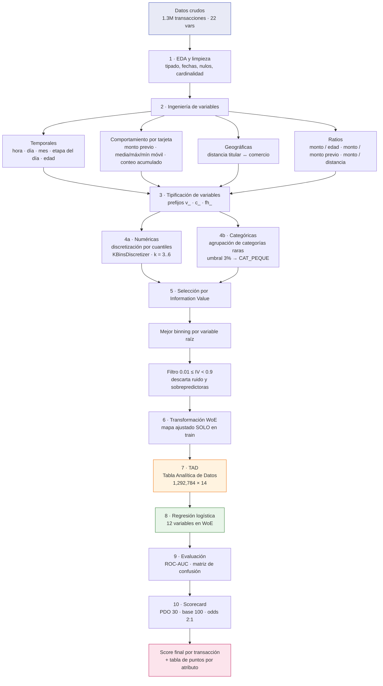

# Fraud_Detection_model
The following project provides the development of a Logistic Regression Model following the Weight of Evidence and information value statistic valuation for selecting the best predictable values.

# Credit Scorecard para Detección de Fraude Transaccional

**Modelo de clasificación binaria (regresión logística + WoE/IV) traducido a una tarjeta de puntuación interpretable, sobre 1.3M de transacciones con tarjeta de crédito.**


---

## Resumen

Este proyecto implementa el pipeline completo de un **scorecard de riesgo** al estilo de la industria financiera: desde el análisis exploratorio hasta la tarjeta de puntos final que un analista de negocio puede leer sin saber nada de machine learning.

A diferencia de un enfoque puramente predictivo (donde bastaría con lanzar un XGBoost), aquí el objetivo es **interpretabilidad + auditabilidad**: cada variable se discretiza, se evalúa con *Information Value*, se transforma con *Weight of Evidence* y finalmente se convierte en **puntos** que se suman para producir un score. Es la metodología que usan buró de crédito, bancos y áreas de riesgo precisamente porque el modelo debe poder explicarse ante un regulador.

**Pregunta de negocio:** dada una transacción, ¿qué tan probable es que sea fraudulenta, y cómo justificamos esa decisión?

---

## Datos

| | |
|---|---|
| **Fuente** | Simulated Credit Card Transactions (`fraudTrain.csv`) |
| **Volumen** | 1,296,675 transacciones × 22 variables |
| **Target** | `is_fraud` — binaria |
| **Tasa de evento** | **0.58%** (fuertemente desbalanceada) |
| **Granularidad** | Una fila = una transacción |
| **Periodo** | Serie temporal de transacciones por número de tarjeta (`cc_num`) |

Las variables originales cubren tres bloques: **transacción** (monto, fecha, comercio, categoría), **tarjetahabiente** (demográficos, ubicación, ocupación) y **geolocalización del comercio**.

---

## Pipeline del proyecto



---

## Metodología paso a paso

### 1. Exploración y limpieza

Perfilado de tipos reales por columna (no solo `dtypes`, sino el tipo de cada valor), conversión de `trans_date_trans_time` y `dob` a `datetime`, normalización de `zip` a 5 dígitos con relleno de ceros, y descripción por percentiles de 1 en 1 para detectar colas y outliers en montos.

### 2. Ingeniería de variables

El dataset crudo es "plano": cada fila desconoce el historial de la tarjeta. El valor real del proyecto está aquí — se construye **contexto de comportamiento**:

| Familia | Variables | Intuición de riesgo |
|---|---|---|
| Temporal | `hour`, `day`, `month`, `dayofweek`, `etapa_del_dia` | El fraude se concentra en franjas horarias atípicas (madrugada) |
| Demográfica | `age` al momento de la transacción | Perfil del tarjetahabiente |
| Historial | `prev_trans_amt`, `prev_trans_mean/max/min`, `prev_trans_count` | Un monto normal *en absoluto* puede ser anómalo *para esa tarjeta* |
| Geográfica | `dist_lat_long` entre titular y comercio | Compras muy lejos del domicilio habitual |
| Ratios | `amt/age`, `amt/prev_trans_amt`, `amt/dist_lat_long`, etc. | Normalizan el monto contra la referencia propia del cliente |

> Los ratios resultaron ser las variables con mayor poder predictivo bruto, por encima de las variables crudas.

### 3. Discretización y normalización

- **Numéricas:** `KBinsDiscretizer` con estrategia `quantile` probando k = 3, 4, 5 y 6 bins. Se genera cada versión y luego se compite entre ellas.
- **Categóricas:** las categorías con frecuencia relativa menor al 3% se colapsan en `CAT_PEQUE`; si el grupo residual sigue siendo marginal, se absorbe en la moda. Esto evita bins con población insuficiente y coeficientes inestables.
- Se eliminan variables unarias (una sola categoría tras agrupar → información nula).

### 4. Selección de variables: Information Value

Para cada variable candidata se construye la tabla de contingencia contra el target y se calcula:

$$WoE_i = \ln\left(\frac{\%\ \text{No evento}_i}{\%\ \text{Evento}_i}\right) \qquad IV = \sum_i (\%\text{No evento}_i - \%\text{Evento}_i)\times WoE_i$$

Criterios aplicados:

1. De todas las versiones de binning de una misma variable raíz, se conserva **la de mayor IV**.
2. Se descartan IV infinitos (bins sin ningún evento).
3. Se aplica la banda **0.01 ≤ IV < 0.9**.

El límite superior es deliberado y es el punto metodológico más interesante del proyecto: variables como `amt` (IV = 3.21) o `ratio_amt_age` (IV = 2.51) son **sospechosamente buenas**. En la práctica de riesgo, un IV por encima de ~0.5 suele indicar separación casi perfecta, sobreajuste o fuga de información, y un scorecard construido sobre ellas colapsa fuera de muestra. Se sacrifica AUC a cambio de estabilidad.

**Resultado: 12 variables finales**

`etapa_del_dia` · `category` · `prev_trans_count` · `ratio_amt_prev_trans_amt` · `month` · `month_desc` · `age` · `unix_time` · `day` · `dayofweek` · `dayofweek_desc` · `gender`

### 5. Transformación WoE

Cada bin se reemplaza por su WoE. Esto convierte variables categóricas y numéricas discretizadas en una **escala continua, monótona respecto al log-odds y comparable entre variables** — que es exactamente lo que la regresión logística necesita, sin one-hot encoding ni estandarización.

El mapa WoE se calcula **únicamente sobre la partición de entrenamiento** y se aplica a validación.

### 6. Modelo

$$\ln\left(\frac{p}{1-p}\right) = \beta_0 + \sum_{i=1}^{12}\beta_i \cdot WoE_i$$

Partición 70/30. Intercepto ajustado: **−5.14** (coherente con una tasa base de evento del 0.58%). Los coeficientes son mayormente negativos, lo cual es el signo esperado: WoE alto = perfil de bajo riesgo = menor log-odds de fraude.

### 7. Traducción a scorecard

La salida del modelo se lleva a una escala de puntos con la parametrización estándar de la industria:

| Parámetro | Valor | Significado |
|---|---|---|
| `PDO` | 30 | Puntos necesarios para duplicar los odds |
| `base_score` | 100 | Score de anclaje |
| `base_odds` | 2 | Odds en el score de anclaje (2:1) |
| `factor` | 43.28 | `PDO / ln(2)` |
| `offset` | 70.00 | `base_score − factor · ln(base_odds)` |

$$\text{puntos}_i = -\left(WoE_i \cdot \beta_i + \frac{\beta_0}{n}\right)\cdot \text{factor} + \frac{\text{offset}}{n}$$

$$\text{Score} = \sum_{i=1}^{n} \text{puntos}_i$$

El entregable final es una **tabla atributo → puntos**: para cada característica y cada uno de sus bins, cuántos puntos aporta. Un analista puede aplicarla a mano, en Excel o en un motor de reglas, sin ejecutar Python.

---

## Resultados

| Métrica | Validación |
|---|---|
| **ROC-AUC** | **0.834** |
| Accuracy | 0.994 |
| Registros de validación | 387,836 |
| Eventos reales | 2,178 (0.56%) |

**Lectura honesta de estos números:**

- Un **AUC de 0.834** es un resultado sólido para un scorecard interpretable de 12 variables, y sobre todo *después* de haber descartado deliberadamente las variables sobrepredictoras.
- El **accuracy de 0.994 no significa nada**. Con una tasa de evento del 0.58%, un modelo que prediga "no fraude" siempre obtiene 99.42%. De hecho, al umbral por defecto de 0.5 el modelo no clasifica ninguna transacción como fraude: la matriz de confusión es `[[385658, 0], [2178, 0]]`.
- Esto **no invalida el modelo**, lo reposiciona: el valor no está en la clasificación dura sino en el **ordenamiento por riesgo**. La distribución de score separa visiblemente fraudes de no-fraudes, y la operación real consiste en definir un **punto de corte** según la capacidad del área de monitoreo (p. ej. revisar el 1% de transacciones con menor score) y no en aceptar el umbral de 0.5.

Las distribuciones de score por clase (`is_fraud = 0` vs `is_fraud = 1`) se grafican al final del notebook y son la evidencia visual de esa separación.

---

## Estructura del repositorio

```
.
├── README.md
├── notebooks/
│   └── clasificacion_binaria_scoring.ipynb   # Pipeline completo end-to-end
├── data/
│   ├── df_fraude.parquet                     # Dataset con feature engineering
│   └── tad_fraude_final.parquet              # Tabla Analítica de Datos (WoE)
└── requirements.txt
```

> El CSV original no se versiona por tamaño. Ver sección de reproducción.

---

## Cómo reproducirlo

```bash
git clone https://github.com/<usuario>/<repo>.git
cd <repo>
pip install -r requirements.txt
```

1. Descargar `fraudTrain.csv` y colocarlo en `fraud/`.
2. Ejecutar el notebook de principio a fin (`Run All`).
3. Los artefactos intermedios se escriben en `data/`.

**Dependencias principales:** `pandas`, `numpy`, `scikit-learn`, `matplotlib`, `seaborn`, `pyarrow`.

---

## Limitaciones y siguientes pasos

Documentar lo que falta es parte del trabajo. Roadmap identificado:

- [ ] **Partición temporal.** El split actual es aleatorio; en fraude lo correcto es entrenar con el pasado y validar con el futuro (*out-of-time*) para simular producción.
- [ ] **Ordenamiento explícito antes de los rezagos.** Las variables `shift`/`rolling` por tarjeta asumen orden cronológico; conviene forzar `sort_values(['cc_num','trans_date_trans_time'])` y encapsular la ventana móvil dentro del `groupby` con `transform`.
- [ ] **Selección de variables sobre train, no sobre el total.** Calcular el IV únicamente en la partición de entrenamiento para eliminar cualquier optimismo en la selección.
- [ ] **Multicolinealidad.** `month`/`month_desc` y `dayofweek`/`dayofweek_desc` son la misma información codificada dos veces (coeficientes idénticos). Depurar duplicados y validar con VIF.
- [ ] **Métricas adecuadas al desbalance.** Incorporar PR-AUC, KS y curva de ganancia; sustituir accuracy por análisis por decil de score.
- [ ] **Optimización del punto de corte** en función del costo de un falso negativo (fraude no detectado) vs. un falso positivo (transacción legítima bloqueada).
- [ ] **Benchmark contra modelo no lineal** (LightGBM) para cuantificar el costo real de la interpretabilidad.
- [ ] **Validación de estabilidad** con PSI entre desarrollo y validación.

---

## Stack

`Python` · `pandas` · `NumPy` · `scikit-learn` · `Matplotlib` · `Seaborn` · `Parquet`

## Conceptos aplicados

Weight of Evidence · Information Value · Binning por cuantiles · Regresión logística · Scorecard PDO/offset/factor · Clases desbalanceadas · Feature engineering temporal y de comportamiento · ROC-AUC

---

## Autor

**Alfredo** — Data Engineer / Data Science
